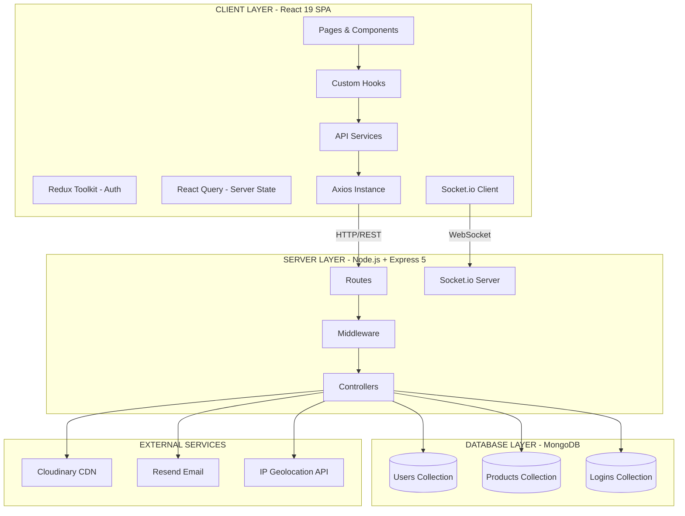

# Prompt 1: System Architecture Diagram

## Instructions for AI Diagram Tool (Eraser,Mermaid, Excalidraw, Draw.io, etc.)

Create a comprehensive **System Architecture Diagram** for an Online Auction System with the following specifications:

---

## Diagram Type
**Multi-tier Architecture Diagram** with clear separation of concerns showing Frontend, Backend, Database, and External Services.

---

## Components to Include

### 1. CLIENT LAYER (Top)
**React 19 SPA (Port 5173)**
- **UI Components**
  - Pages (Landing, Dashboard, ViewAuction, CreateAuction, MyBids, Admin)
  - Components (Navbar, AuctionCard, Footer, DialogBox)
  
- **State Management**
  - Redux Toolkit (Auth State: user, loading, error)
  - React Query (Server State: auctions, bids, stats)
  
- **Real-time Layer**
  - Socket.io Client (WebSocket connection)
  - useSocket Hook (Room management)
  
- **Data Layer**
  - Hooks (useAuction, useAdmin, useUser, useSocket)
  - Services (auction.service, user.service, admin.service)
  - Axios Instance (withCredentials: true)

### 2. COMMUNICATION LAYER (Middle)
Show two distinct communication channels:
- **HTTP/REST API** (Axios → Express)
  - JSON payloads
  - httpOnly cookies for auth
  - CORS enabled
  
- **WebSocket** (Socket.io Client → Socket.io Server)
  - Real-time bidding events
  - User presence tracking
  - JWT authentication via cookies

### 3. SERVER LAYER (Backend)
**Node.js + Express 5 (Port 3000)**

- **Entry Points**
  - app.js (Express app configuration)
  - server.js (HTTP server + Socket.io initialization)
  - index.js (Vercel serverless entry)

- **Middleware Layer**
  - CORS (origin validation)
  - Cookie Parser (auth_token extraction)
  - Compression (gzip)
  - Auth Middleware (secureRoute, checkAdmin)
  - Multer (file upload to Cloudinary)

- **Routes**
  - /auth (login, signup, logout)
  - /user (profile, password change, login history)
  - /auction (CRUD, bidding, stats)
  - /admin (dashboard, user management)
  - /contact (email form)

- **Controllers**
  - auth.controller (JWT generation, bcrypt hashing)
  - auction.controller (CRUD, atomic bid updates)
  - user.controller (profile management)
  - admin.controller (platform analytics)
  - contact.controller (email sending)

- **Socket.io Server**
  - JWT Authentication Middleware
  - Auction Room Handlers
  - Events: auction:join, auction:leave, auction:bid
  - Broadcasts: auction:bidPlaced, auction:userJoined, auction:userLeft
  - Active User Tracking (Map<auctionId, Map<socketId, userData>>)

### 4. DATABASE LAYER
**MongoDB Atlas (Cloud)**
- **Collections**
  - users (name, email, password, role, location, ipAddress)
  - products (auctions with embedded bids array)
  - logins (TTL index: 6 months auto-expire)
  
- **Indexes**
  - products: itemEndDate, seller, itemCategory, createdAt
  - users: email (unique)
  - logins: userId, loginAt (TTL)

### 5. EXTERNAL SERVICES (Right Side)
- **Cloudinary CDN**
  - Image upload and storage
  - Optimized delivery
  - Connected via: Multer middleware
  
- **Resend Email Service**
  - Transactional emails
  - Contact form delivery
  - XSS-safe HTML templates
  
- **IP Geolocation API**
  - ip-api.com
  - Location tracking on login
  - Returns: country, region, city, ISP

### 6. DEPLOYMENT INFRASTRUCTURE (Bottom)
- **Frontend Hosting**
  - Vercel Edge Network
  - SPA routing (/* → /index.html)
  - Environment: VITE_API, VITE_AUCTION_API
  
- **Backend Hosting**
  - AWS EC2 Instance
  - PM2 Process Manager
  - GitHub Actions CI/CD
  - Graceful shutdown handling
  
- **Database Hosting**
  - MongoDB Atlas (Cloud)
  - Connection pooling
  - Automatic backups

---

## Data Flow Arrows

### Authentication Flow
1. User → Login Form → POST /auth/login
2. Server → bcrypt.compare(password)
3. Server → generateToken(userId, role)
4. Server → setCookie(res, token) [httpOnly, Secure]
5. Server → Save login record (IP, location, device)
6. Client → Receives cookie automatically
7. Client → Redux updates auth state
8. All subsequent requests → Cookie sent automatically

### Real-time Bidding Flow
1. User opens ViewAuction page
2. useSocket hook → connectSocket()
3. Socket.io Client → emit("auction:join", { auctionId })
4. Server → JWT verification from cookie
5. Server → Add user to auction room Map
6. Server → broadcast("auction:userJoined") to room
7. User places bid → emit("auction:bid", { auctionId, bidAmount })
8. Server → Validate bid (not seller, within range, auction active)
9. Server → findOneAndUpdate with price condition (atomic)
10. Server → broadcast("auction:bidPlaced") to all users in room
11. All clients → Update UI instantly via useSocket hook

### Auction Creation Flow
1. User → CreateAuction form with image
2. Client → FormData with multipart/form-data
3. Server → Multer middleware intercepts file
4. Multer → Upload to Cloudinary
5. Cloudinary → Returns image URL
6. Server → Create Product document with image URL
7. Server → Save to MongoDB
8. Client → React Query invalidates auction queries
9. Client → Navigate to auction list

---

## Visual Style Guidelines

### Colors
- **Frontend**: Light blue (#3B82F6)
- **Backend**: Green (#10B981)
- **Database**: Orange (#F59E0B)
- **External Services**: Purple (#8B5CF6)
- **Communication**: Gray arrows with labels

### Layout
- **Vertical orientation** (top to bottom)
- **Clear layer separation** with horizontal dividers
- **Grouped components** in rounded rectangles
- **Bidirectional arrows** for request/response
- **Unidirectional arrows** for broadcasts

### Labels
- Show **port numbers** (5173, 3000, 27017)
- Show **protocols** (HTTP, WebSocket, TCP)
- Show **data formats** (JSON, FormData, Binary)
- Show **authentication** (JWT, httpOnly cookies)

---

## Key Highlights to Emphasize

1. **Dual Communication Channels**: HTTP for CRUD, WebSocket for real-time
2. **JWT Authentication**: Used by both REST API and Socket.io
3. **Atomic Updates**: MongoDB findOneAndUpdate prevents race conditions
4. **State Management Split**: Redux for auth, React Query for server data
5. **Room-based Architecture**: Each auction has isolated Socket.io room
6. **Graceful Shutdown**: Proper cleanup of connections and resources
7. **CDN Integration**: Images served from Cloudinary, not server
8. **Security Layers**: httpOnly cookies, bcrypt, CORS, input sanitization

---

## Example Mermaid Code Structure (Optional)

---

## Output Format
- **High-resolution PNG or SVG**
- **Professional color scheme**
- **Clear typography** (readable at all zoom levels)
- **Legend** explaining icons and colors
- **Title**: "Online Auction System - System Architecture"
