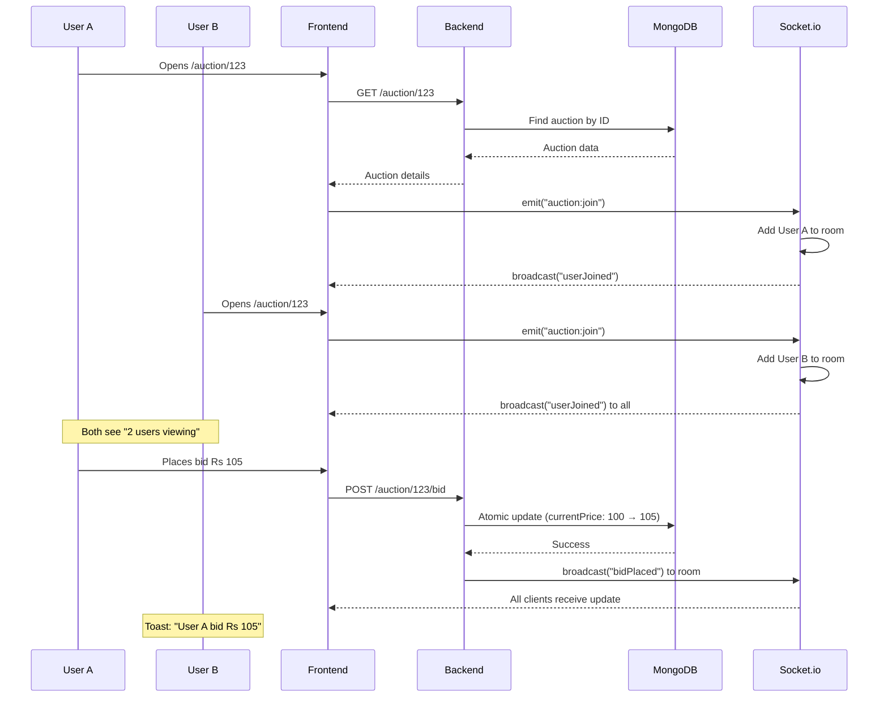

# Prompt 2: User Workflow & Real-Time Bidding Diagram

## Instructions for AI Diagram Tool (Mermaid, Excalidraw, Draw.io, etc.)

Create a comprehensive **User Workflow Diagram** showing the complete user journey and real-time bidding process for an Online Auction System.

---

## Diagram Type
**Swimlane Diagram** with multiple actors showing parallel interactions and real-time synchronization.

---

## Actors/Swimlanes (Left to Right)

### 1. USER A (Bidder 1)
- Browser with React App
- Socket.io connection
- Redux auth state
- React Query cache

### 2. USER B (Bidder 2)
- Separate browser/device
- Independent Socket.io connection
- Own auth session
- Own React Query cache

### 3. FRONTEND LAYER
- React Components
- useSocket Hook
- State Management
- Toast Notifications

### 4. BACKEND LAYER
- Express REST API
- Socket.io Server
- Authentication Middleware
- Controllers

### 5. DATABASE
- MongoDB
- Atomic Operations
- Real-time Queries

### 6. EXTERNAL SERVICES
- Cloudinary (images)
- Resend (emails)
- Geo API (location)

---

## Complete User Journey Flow

### PHASE 1: Registration & Authentication (User A)


**Step 1: User visits landing page**
- User A → Opens http://localhost:5173
- Frontend → Renders Landing component
- InitAuth → Dispatches checkAuth()
- Backend → GET /user (no cookie found)
- Frontend → Shows guest landing page

**Step 2: User signs up**
- User A → Clicks "Sign Up" button
- User A → Fills form (name, email, password)
- Frontend → Dispatches signup() thunk
- Backend → POST /auth/signup
- Backend → Validates input (password ≥ 8 chars)
- Backend → Checks if email exists
- Backend → bcrypt.hash(password, 10)
- Geo API → Gets location from IP address
- Database → Saves new User document
- Database → Saves Login record (IP, location, device)
- Backend → generateToken(userId, role)
- Backend → setCookie(res, token) [httpOnly, Secure, SameSite]
- Frontend → GET /user (cookie sent automatically)
- Frontend → Redux updates: user = { name, email, role }
- Frontend → Navigate to Dashboard

**Step 3: Auto-login on refresh**
- User A → Refreshes page (F5)
- Frontend → InitAuth runs checkAuth()
- Frontend → GET /user (cookie sent automatically)
- Backend → Verifies JWT from cookie
- Backend → Returns user data
- Frontend → Redux restores auth state
- Frontend → User stays logged in

---

### PHASE 2: Auction Creation (User A)

**Step 1: Navigate to create auction**
- User A → Clicks "Create Auction" in navbar
- Frontend → Navigate to /create
- Frontend → Renders CreateAuction form

**Step 2: Fill auction details**
- User A → Enters item name, description, category
- User A → Sets starting price (e.g., Rs 100)
- User A → Selects start date (now) and end date (tomorrow)
- User A → Uploads image file (JPEG/PNG)
- Frontend → Shows image preview

**Step 3: Submit auction**
- User A → Clicks "Create Auction"
- Frontend → Creates FormData with multipart/form-data
- Frontend → POST /auction (with auth cookie)
- Backend → secureRoute middleware verifies JWT
- Backend → Multer intercepts file upload
- Cloudinary → Receives image, returns URL
- Backend → Creates Product document:
  ```javascript
  {
    itemName, itemDescription, itemCategory,
    startingPrice, currentPrice: startingPrice,
    itemStartDate, itemEndDate,
    seller: userId,
    itemPhoto: cloudinaryUrl,
    bids: []
  }
  ```
- Database → Saves Product document
- Backend → Returns success response
- Frontend → React Query invalidates ["auctions"] cache
- Frontend → Toast notification: "Auction created successfully"
- Frontend → Navigate to /myauction

---

### PHASE 3: Real-Time Bidding (User A & User B)

**Step 1: User B signs up (parallel to User A)**
- User B → Opens app in incognito/different browser
- User B → Signs up with different email
- Backend → Same signup flow as User A
- User B → Now authenticated with own session

**Step 2: Both users navigate to same auction**
- User A → Clicks on auction card
- User A → Navigate to /auction/:id
- Frontend A → useViewAuction(id) fetches auction data
- Frontend A → useSocket(auctionId, userIdA) initializes
- Socket Client A → connectSocket()
- Socket Client A → emit("auction:join", { auctionId })
- Socket Server → Verifies JWT from cookie
- Socket Server → socket.join(auctionId) [Room created]
- Socket Server → auctionRooms.set(auctionId, Map with User A)
- Socket Server → broadcast("auction:userJoined", { userName: "User A", activeUsers: [User A] })
- Frontend A → Updates activeUsers state: [User A]
- Frontend A → Shows "1 user viewing"

**[2 seconds later]**

- User B → Clicks same auction card
- User B → Navigate to /auction/:id
- Frontend B → useViewAuction(id) fetches auction data
- Frontend B → useSocket(auctionId, userIdB) initializes
- Socket Client B → connectSocket()
- Socket Client B → emit("auction:join", { auctionId })
- Socket Server → Verifies JWT from cookie
- Socket Server → socket.join(auctionId) [Joins existing room]
- Socket Server → auctionRooms.get(auctionId).set(socketIdB, User B)
- Socket Server → broadcast("auction:userJoined", { userName: "User B", activeUsers: [User A, User B] })
- Frontend A → Toast: "User B joined the auction 👋"
- Frontend A → Updates activeUsers: [User A, User B]
- Frontend B → Updates activeUsers: [User A, User B]
- Both Frontends → Show "2 users viewing"

**Step 3: User A places first bid**
- User A → Enters bid amount: Rs 105
- User A → Clicks "Place Bid"
- Frontend A → Validates: currentPrice + 1 ≤ bid ≤ currentPrice + 10
- Frontend A → POST /auction/:id/bid { bidAmount: 105 }
- Backend → secureRoute verifies JWT
- Backend → Validates:
  - Auction exists and active
  - User is not the seller
  - Bid within allowed range
- Backend → Atomic update:
  ```javascript
  findOneAndUpdate(
    { _id: auctionId, currentPrice: 100 }, // Condition
    { 
      $set: { currentPrice: 105 },
      $push: { bids: { bidder: userIdA, bidAmount: 105 } }
    }
  )
  ```
- Database → Updates Product document (atomic operation)
- Backend → Returns updated auction
- Backend → getIO().to(auctionId).emit("auction:bidPlaced", { auction, bidderName: "User A", bidAmount: 105 })
- Socket Server → Broadcasts to all users in room
- Frontend A → Updates liveAuction state
- Frontend A → Shows updated price: Rs 105
- Frontend A → No toast (own bid)
- Frontend B → Receives socket event
- Frontend B → Updates liveAuction state
- Frontend B → Toast: "User A placed a bid of Rs 105 ✓"
- Frontend B → Shows updated price: Rs 105
- Frontend B → Bid history updates instantly

**Step 4: User B places competing bid (Race Condition Test)**
- User B → Enters bid amount: Rs 110
- User B → Clicks "Place Bid"
- Frontend B → POST /auction/:id/bid { bidAmount: 110 }

**[At the EXACT same time]**

- User A → Enters bid amount: Rs 110
- User A → Clicks "Place Bid"
- Frontend A → POST /auction/:id/bid { bidAmount: 110 }

**Race Condition Prevention:**
- Backend → Receives both requests simultaneously
- Backend → First request:
  ```javascript
  findOneAndUpdate(
    { _id: auctionId, currentPrice: 105 }, // ✓ Matches
    { $set: { currentPrice: 110 }, $push: { bids: ... } }
  )
  ```
  - Database → Updates successfully
  - Backend → Returns success to User B
  - Socket Server → broadcast("auction:bidPlaced")
  
- Backend → Second request (milliseconds later):
  ```javascript
  findOneAndUpdate(
    { _id: auctionId, currentPrice: 105 }, // ✗ No longer matches (now 110)
    { ... }
  )
  ```
  - Database → Returns null (condition failed)
  - Backend → Returns 409 error: "Bid failed — price changed"
  - Frontend A → Toast error: "Someone bid higher, try again"

**Step 5: Countdown timer reaches zero**
- Frontend A & B → setInterval updates countdown every second
- Timer → Reaches 00:00:00
- Frontend → Shows "Auction Ended"
- Backend → Auto-winner detection on next view:
  ```javascript
  if (isExpired && !winner && bids.length > 0) {
    const highestBid = bids.sort((a,b) => b.bidAmount - a.bidAmount)[0];
    auction.winner = highestBid.bidder;
    auction.isSold = true;
    await auction.save();
  }
  ```
- Frontend → Shows winner announcement: "User B won with Rs 110"

---

### PHASE 4: Admin Panel Workflow

**Step 1: Admin access**
- Admin → Manually changes role in MongoDB: role = "admin"
- Admin → Logs out and logs in again
- Frontend → checkAuth() returns role: "admin"
- Frontend → Navbar shows "Admin Panel" link

**Step 2: View platform statistics**
- Admin → Clicks "Admin Panel"
- Frontend → GET /admin/dashboard
- Backend → checkAdmin middleware verifies role
- Backend → MongoDB aggregation queries:
  - Total users count
  - Total auctions count
  - Total bids count
  - Platform revenue calculation
- Backend → Returns statistics
- Frontend → Renders AdminDashboard with charts

**Step 3: User management**
- Admin → Clicks "Users" tab
- Frontend → GET /admin/users?page=1&limit=10&search=&role=all
- Backend → Paginated query with filters
- Backend → Returns user list
- Frontend → Renders UsersList table
- Admin → Searches for "john"
- Frontend → Debounced search → GET /admin/users?search=john
- Frontend → Updates table instantly

---

## Special Scenarios to Show

### Scenario 1: Seller Protection
- User A (seller) → Tries to bid on own auction
- Frontend → POST /auction/:id/bid
- Backend → Checks: product.seller === userId
- Backend → Returns 403: "You cannot bid on your own auction"
- Frontend → Toast error message
- Frontend → Bid form disabled for seller

### Scenario 2: Hover Prefetching
- User A → Hovers over auction card (doesn't click)
- Frontend → onMouseEnter event
- Frontend → prefetchAuction(auctionId)
- React Query → GET /auction/:id (background)
- React Query → Stores in cache with 30s staleTime
- User A → Clicks card (1 second later)
- Frontend → Data loads instantly from cache
- Frontend → No loading spinner needed

### Scenario 3: Socket Reconnection
- User A → Viewing auction (connected)
- Network → Drops connection
- Socket Client → Detects disconnect
- Socket Client → Auto-reconnect (attempt 1 of 10)
- Socket Client → Reconnects successfully
- Socket Client → emit("auction:join", { auctionId })
- Socket Server → Re-adds user to room
- Frontend → Shows "Reconnected" indicator

---

## Visual Elements to Include

### Icons
- 👤 User avatars
- 🔒 Lock icon for authentication
- ⚡ Lightning bolt for real-time
- 📊 Chart icon for analytics
- 🖼️ Image icon for uploads
- ✉️ Email icon for notifications
- ⏱️ Timer icon for countdown

### Status Indicators
- 🟢 Connected (green dot)
- 🔴 Disconnected (red dot)
- 🟡 Reconnecting (yellow dot)
- ✓ Success (green checkmark)
- ✗ Error (red X)

### Annotations
- **[Atomic]** for race condition prevention
- **[Broadcast]** for socket events to all users
- **[Cached]** for React Query cached data
- **[Real-time]** for instant updates
- **[Secure]** for httpOnly cookies

---

## Timeline Visualization

Show events happening in parallel:

```
Time    User A                  User B                  Server
0s      Opens auction page      -                       -
1s      Socket connects         -                       Room created
2s      Joins room              Opens same auction      -
3s      Sees "2 users viewing"  Socket connects         User B joins room
4s      -                       Sees "2 users viewing"  Broadcast userJoined
5s      Places bid Rs 105       -                       Validates bid
6s      Sees price update       Receives socket event   Atomic DB update
7s      -                       Toast: "User A bid 105" Broadcast bidPlaced
8s      -                       Places bid Rs 110       Validates bid
9s      Receives socket event   Sees price update       Atomic DB update
10s     Toast: "User B bid 110" -                       Broadcast bidPlaced
```

---

## Key Workflows to Illustrate

### Workflow 1: Complete Auction Lifecycle
1. **Creation** → User creates auction with image
2. **Active** → Auction appears in listings
3. **Bidding** → Multiple users place bids in real-time
4. **Countdown** → Timer updates every second
5. **Expiry** → Timer reaches zero
6. **Winner** → Highest bidder automatically assigned
7. **Closed** → Auction marked as sold

### Workflow 2: Real-Time Synchronization
Show how a single bid updates multiple connected clients:
- User A places bid
- Server validates and updates DB
- Server broadcasts to Socket.io room
- User B, C, D all receive update simultaneously
- All UIs update within 100ms
- Toast notifications appear for other users

### Workflow 3: Authentication Persistence
- User logs in → Cookie set
- User closes browser
- User reopens browser
- Cookie still valid
- Auto-login successful
- User sees dashboard immediately

### Workflow 4: Admin Operations
- Admin searches for user
- Admin changes user role
- Admin deletes user
- React Query invalidates cache
- User list updates instantly
- Deleted user's auctions remain (data integrity)

---

## Decision Points (Diamond Shapes)

Include decision diamonds for:
- ❓ Is user authenticated? → Yes: Dashboard, No: Landing
- ❓ Is auction active? → Yes: Allow bid, No: Show winner
- ❓ Is user the seller? → Yes: Block bid, No: Allow bid
- ❓ Is bid within range? → Yes: Process, No: Error
- ❓ Did atomic update succeed? → Yes: Broadcast, No: Retry
- ❓ Is user admin? → Yes: Show admin panel, No: 403 error

---

## Error Handling Flows

### Error 1: Invalid Bid
- User → Enters bid Rs 50 (too low, min is Rs 106)
- Frontend → Validates locally
- Frontend → Shows error: "Bid must be at least Rs 106"
- Frontend → Prevents API call

### Error 2: Race Condition
- User A & B → Both bid Rs 110 simultaneously
- Backend → First request succeeds
- Backend → Second request fails (price changed)
- Frontend B → Receives 409 error
- Frontend B → Toast: "Bid failed — price changed. Try again."
- Frontend B → Shows updated price from first bid

### Error 3: Socket Disconnection
- User → Viewing auction
- Network → Connection lost
- Socket Client → Detects disconnect
- Frontend → Shows "Disconnected" indicator
- Socket Client → Auto-reconnect (10 attempts)
- Socket Client → Reconnects successfully
- Frontend → Shows "Connected" indicator
- Socket Client → Re-joins auction room

---

## Data Flow Annotations

### For Each Arrow, Show:
1. **Protocol**: HTTP, WebSocket, TCP
2. **Method**: GET, POST, PATCH, emit, broadcast
3. **Payload**: { auctionId, bidAmount }, { user }, etc.
4. **Auth**: Cookie, JWT, None
5. **Response Time**: <100ms, <500ms, Real-time

### Example Annotations:
- `POST /auction/:id/bid` → `{ bidAmount: 105 }` → `Cookie: auth_token` → `200ms`
- `emit("auction:bid")` → `{ auctionId, bidAmount }` → `JWT verified` → `<50ms`
- `broadcast("auction:bidPlaced")` → `{ auction, bidderName }` → `All room users` → `Real-time`

---

## Visual Style Guidelines

### Colors by Action Type
- **Read Operations**: Blue (#3B82F6)
- **Write Operations**: Green (#10B981)
- **Real-time Events**: Red (#EF4444)
- **Authentication**: Purple (#8B5CF6)
- **Errors**: Orange (#F59E0B)

### Line Styles
- **Solid lines**: Synchronous operations
- **Dashed lines**: Asynchronous operations
- **Bold lines**: Real-time broadcasts
- **Dotted lines**: Background processes

### Shapes
- **Rectangles**: Actions/processes
- **Rounded rectangles**: Components/services
- **Diamonds**: Decision points
- **Cylinders**: Database operations
- **Clouds**: External services
- **Circles**: Start/end points

---

## Key Highlights to Emphasize

1. **Parallel User Interactions**: Show User A and User B acting simultaneously
2. **Real-time Synchronization**: Emphasize instant updates across all clients
3. **Atomic Operations**: Highlight race condition prevention
4. **Authentication Flow**: Show cookie-based auth for both HTTP and WebSocket
5. **Error Recovery**: Show graceful error handling and retry logic
6. **State Management**: Show Redux for auth, React Query for server data
7. **Optimistic Updates**: Show UI updates before server confirmation
8. **Auto-winner Detection**: Show automatic winner assignment on expiry

---

## Additional Scenarios (Optional)

### Scenario: Contact Form
- Guest user → Fills contact form
- Frontend → POST /contact { name, email, message }
- Backend → Validates and sanitizes input
- Resend API → Sends email to admin
- Resend API → Sends confirmation to user
- Frontend → Toast: "Message sent successfully"

### Scenario: Password Change
- User → Goes to Profile page
- User → Enters old password, new password, confirm
- Frontend → PATCH /user { oldPassword, newPassword }
- Backend → Verifies old password with bcrypt
- Backend → Hashes new password
- Database → Updates user document
- Frontend → Toast: "Password changed successfully"
- Frontend → Logs out user
- User → Logs in with new password

### Scenario: Login History
- User → Clicks "Login History"
- Frontend → GET /user/logins
- Backend → Queries Login collection
- Backend → Returns last 10 logins with:
  - IP address
  - Location (city, country)
  - Device type
  - Browser
  - Timestamp
- Frontend → Renders table with security info

---

## Example Mermaid Code Structure (Optional)



---

## Output Format
- **High-resolution PNG or SVG**
- **Swimlane layout** (horizontal or vertical)
- **Clear timeline** with timestamps
- **Color-coded** by action type
- **Annotations** for key technical details
- **Legend** explaining symbols and colors
- **Title**: "Online Auction System - User Workflow & Real-Time Bidding"

---

## Pro Tips for Best Results

1. **Use sequence diagram** for time-based flows
2. **Use swimlane diagram** for multi-actor scenarios
3. **Show parallel actions** side-by-side
4. **Highlight critical paths** with bold lines
5. **Add timing annotations** (0s, 1s, 2s, etc.)
6. **Include error paths** with red dashed lines
7. **Show state changes** in components
8. **Emphasize real-time** with lightning bolt icons
