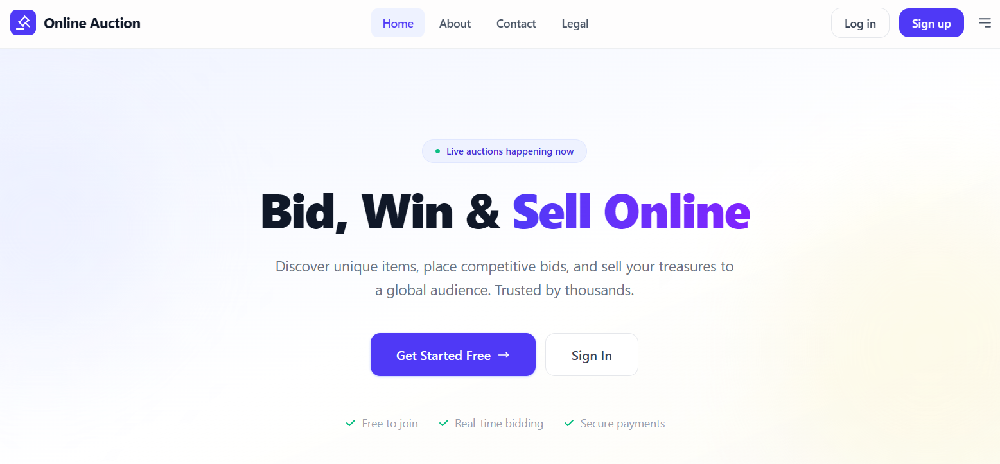
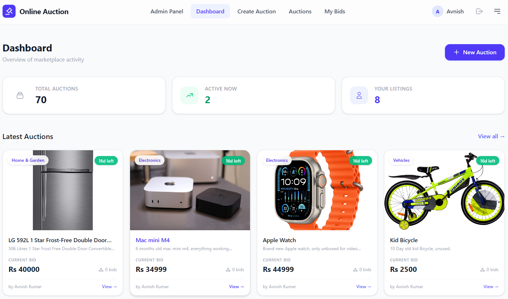
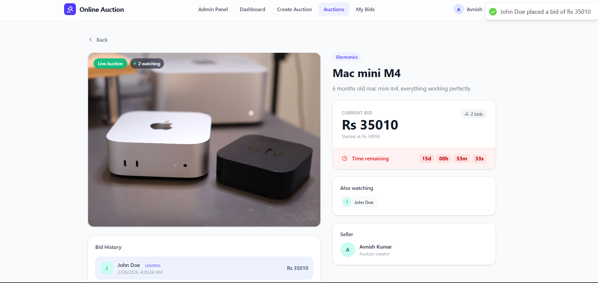
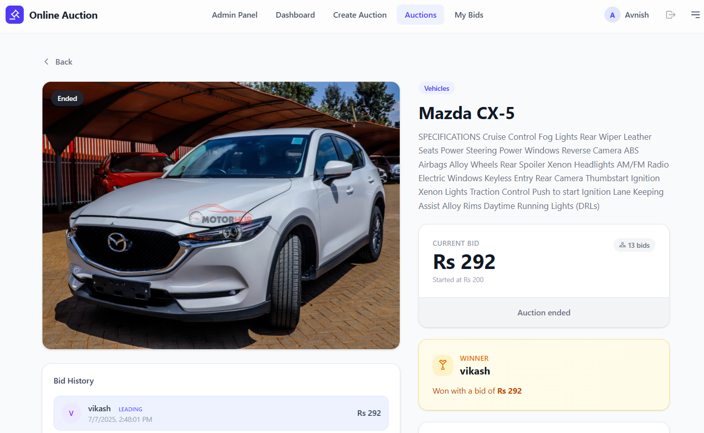
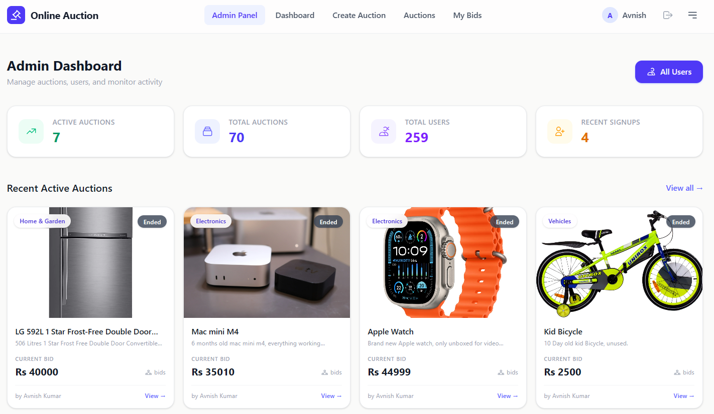

<div align="center">

# CodeBidz

### A full-stack real-time auction platform built with the MERN stack


**Create auctions · Bid in real-time · Earn credits · AI-powered descriptions · Smart recommendations**

[Report Bug](https://github.com/Omkarop0808/CodeBidz/issues) · [Request Feature](https://github.com/Omkarop0808/CodeBidz/issues)

</div>

---

## Screenshots

> Click any image to view full size

<table>
<tr>
<td width="33%" align="center">
<b>Landing Page</b><br><br>
<a href="screenshots/landingpage.png"></a>
</td>
<td width="33%" align="center">
<b>User Dashboard</b><br><br>
<a href="screenshots/dashboard.png"></a>
</td>
<td width="33%" align="center">
<b>Auction Page</b><br><br>
<a href="screenshots/auctionpage.png"></a>
</td>
</tr>
<tr>
<td width="33%" align="center">
<b>Auction Winner</b><br><br>
<a href="screenshots/auctionwinner.png"></a>
</td>
<td width="33%" align="center">
<b>My Bids</b><br><br>
<a href="screenshots/mybids.png"></a>
</td>
<td width="33%" align="center">
<b>Admin Dashboard</b><br><br>
<a href="screenshots/admindashboard.png"></a>
</td>
</tr>
</table>

---

## Why CodeBidz?

Most auction systems stop at basic CRUD. CodeBidz goes much further:

- **Real-time bidding** — Socket.io rooms with atomic MongoDB updates prevent race conditions
- **Credit-based economy** — Users earn starter credits on signup, spend credits to bid, and get refunds on lost auctions
- **AI-powered descriptions** — Auto-generate compelling auction descriptions using Gemini, Groq, or OpenAI (with smart fallback)
- **Smart recommendations** — Trending auctions ranked by recent bid activity, with AI recommendation plug-in ready
- **Admin analytics** — Bid activity charts, top auctions, credit flow, category performance, and leaderboards
- **Real-time notifications** — Bell notifications for bids, wins, and auction updates with read/unread tracking
- **Production security** — httpOnly cookies, JWT auth, XSS-safe email templates, input sanitization

---

## Features

| Category              | Features                                                                                                                                                                        |
| --------------------- | ------------------------------------------------------------------------------------------------------------------------------------------------------------------------------- |
| **Authentication**    | JWT with httpOnly secure cookies · Auto-login on refresh · Role-based access (User/Admin) · Password change with validation                                                     |
| **Auctions**          | Create with image upload (Cloudinary) · Browse with pagination · Category filtering · Live countdown timers · Auto-winner detection on expiry                                   |
| **Real-time Bidding** | Socket.io room-based architecture · Atomic bid updates (no race conditions) · Live active user count · Instant bid broadcast to all viewers · Seller cannot bid on own auction  |
| **Credit System**     | Starter credits on signup (100 credits) · Credit wallet with balance display · Full transaction ledger · Credits deducted on bid, returned on outbid/lost · Paginated history    |
| **AI Descriptions**   | Auto-generate auction descriptions via Gemini / Groq / OpenAI · Smart fallback to mock if no API key · Context-aware prompts with category and item name                       |
| **Notifications**     | Real-time bell notifications · Unread count badge · Mark individual or all as read · Linked to auction items · Paginated notification feed                                      |
| **Recommendations**   | Trending auctions by recent bid activity (30-min window) · Excludes already-bid auctions · AI-ready plug-in architecture for personalized recommendations                      |
| **Analytics (Admin)** | Bid activity over time (hour/day/week) · Top 10 auctions by bid count · Credit flow by month · Category performance breakdown · Top 10 bidders leaderboard · Audit log ready    |
| **Dashboard**         | Personal stats (total/active auctions) · Recent auctions grid · Quick navigation to all sections                                                                                |
| **Admin Panel**       | System-wide statistics · User management with search, sort, pagination · Auction management · Credit management · Recent signups tracking · Role-based route protection         |
| **Security**          | Login tracking (IP, geo-location, device, browser) · Login history per user · bcrypt password hashing · Environment variable validation at startup                              |
| **Email**             | Contact form with Resend · Dual email (admin notification + user confirmation) · XSS-safe HTML templates                                                                        |
| **Performance**       | React Query caching · Hover-based data prefetching · View Transitions API page animations · gzip compression · Optimized MongoDB indexes                                        |

---

## Tech Stack

<table>
<tr><td><b>Frontend</b></td><td><b>Backend</b></td><td><b>Infrastructure</b></td></tr>
<tr><td>

React 19 + Vite  
Tailwind CSS v4  
React Router v7  
Redux Toolkit  
TanStack React Query  
Socket.io Client  
React Hot Toast

</td><td>

Node.js + Express 5  
MongoDB + Mongoose  
Socket.io  
JWT + bcrypt  
Cloudinary + Multer  
Resend (email)  
Compression

</td><td>

Vercel (frontend + backend)  
GitHub Actions CI/CD  
Cloudinary CDN

</td></tr>
</table>

---

## Quick Start

### Prerequisites

- **Node.js** 20+ and npm
- **MongoDB** (local or [Atlas](https://www.mongodb.com/atlas))
- **Cloudinary** account ([free tier](https://cloudinary.com/))

### 1. Clone & Install

```bash
git clone https://github.com/Omkarop0808/CodeBidz.git
cd CodeBidz/online-auction-system

# Install backend
cd server && npm install

# Install frontend
cd ../client && npm install
```

### 2. Environment Variables

**Server** (`server/.env`):

```env
PORT=3000
ORIGIN=http://localhost:5173
MONGO_URL=mongodb://localhost:27017/auction
JWT_SECRET=your-secret-key-here
JWT_EXPIRES_IN=7d
CLOUDINARY_CLOUD_NAME=your-cloud-name
CLOUDINARY_API_KEY=your-api-key
CLOUDINARY_API_SECRET=your-api-secret
CLOUDINARY_URL=cloudinary://...
RESEND_API_KEY=re_xxxxxxxxxxxx
```

**Optional AI keys** (for AI-powered auction descriptions):

```env
GEMINI_API_KEY=your-gemini-key       # Google Gemini
GROQ_API_KEY=your-groq-key           # Groq (Mixtral)
OPENAI_API_KEY=your-openai-key       # OpenAI GPT-3.5
```

> If no AI key is set, the system uses a smart mock fallback — no external API required.

**Client** (`client/.env`):

```env
VITE_API=http://localhost:3000
VITE_AUCTION_API=http://localhost:3000/auction
```

### 3. Run

```bash
# Terminal 1 — Backend
cd server && npm run dev

# Terminal 2 — Frontend
cd client && npm run dev
```

Open **http://localhost:5173** — you're live!

---

## Project Structure

```
online-auction-system/
├── client/                          # React frontend
│   ├── src/
│   │   ├── components/              # Reusable UI (Navbar, AuctionCard, NotificationBell, Footer)
│   │   ├── pages/                   # Route pages (Dashboard, ViewAuction, CreditWallet, etc.)
│   │   │   └── Admin/               # Admin pages (Analytics, AuctionManagement, CreditManagement)
│   │   ├── hooks/                   # React Query hooks + Socket hook
│   │   ├── services/                # API service layer (Axios)
│   │   ├── store/                   # Redux Toolkit (auth state)
│   │   ├── layout/                  # Layouts (Main, Admin, Open)
│   │   └── routers/                 # Route definitions
│   └── package.json
│
├── server/                          # Express backend
│   ├── controllers/                 # Route handlers
│   │   ├── auction.controller.js    # Auction CRUD + bidding
│   │   ├── auth.controller.js       # Login/signup/logout
│   │   ├── credit.controller.js     # Credit balance & history
│   │   ├── ai.controller.js         # AI description generation
│   │   ├── analytics.controller.js  # Admin analytics endpoints
│   │   ├── notification.controller.js # Notification management
│   │   ├── recommendation.controller.js # Smart recommendations
│   │   ├── admin.controller.js      # Admin dashboard & user management
│   │   ├── contact.controller.js    # Contact form emails
│   │   └── user.controller.js       # User profile & password
│   ├── models/                      # Mongoose schemas
│   │   ├── user.model.js            # User (with credits field)
│   │   ├── product.model.js         # Auction/Product
│   │   ├── creditLedger.model.js    # Credit transaction ledger
│   │   ├── notification.model.js    # Notifications
│   │   └── login.model.js           # Login tracking
│   ├── routes/                      # REST API routes
│   ├── socket/                      # Socket.io initialization + auction handlers
│   ├── middleware/                   # Auth + file upload middleware
│   ├── services/                    # Cloudinary integration
│   ├── utils/                       # JWT, cookies, geo-location
│   ├── config/                      # DB + env configuration
│   ├── app.js                       # Express app setup
│   └── server.js                    # HTTP server + Socket.io + graceful shutdown
│
└── README.md
```

---

## Architecture

### Real-time Bidding Flow

```
┌─────────────────────────────────────────────────────────────────┐
│  Client (ViewAuction)                                           │
│                                                                 │
│  useSocket hook                    REST API                     │
│  ┌──────────────┐                 ┌──────────────┐              │
│  │ Connect      │                 │ POST /bid    │              │
│  │ Join Room    │                 │ Atomic Update│              │
│  │ Listen Bids  │                 │ Deduct Credit│              │
│  │ Cleanup      │                 │ Return Data  │              │
│  └──────┬───────┘                 └──────┬───────┘              │
│         │                                │                      │
└─────────┼────────────────────────────────┼──────────────────────┘
          │ WebSocket                      │ HTTP
          │                                │
┌─────────┼────────────────────────────────┼──────────────────────┐
│  Server │                                │                      │
│         ▼                                ▼                      │
│  ┌──────────────┐                 ┌──────────────┐              │
│  │ Socket.io    │                 │ Express API  │              │
│  │ Auth via JWT │                 │ secureRoute  │              │
│  │ Room: {id}   │◄────Broadcast───│ placeBid()   │              │
│  │ Track Users  │                 │ Atomic update│              │
│  └──────────────┘                 └──────────────┘              │
│                                          │                      │
│                                   ┌──────▼───────┐              │
│                                   │   MongoDB    │              │
│                                   │ findOneAndUp │              │
│                                   │ date + price │              │
│                                   │  condition   │              │
│                                   └──────────────┘              │
└─────────────────────────────────────────────────────────────────┘
```

**Race condition prevention**: Bids use `findOneAndUpdate` with a price condition — if two users bid simultaneously, only the first succeeds; the second gets a retry prompt.

### Credit System Flow

```
New User Signup ──► 100 starter credits added ──► CreditLedger entry (type: "assigned")
        │
        ▼
User Places Bid ──► Credits deducted ──► CreditLedger entry (type: "deducted")
        │
        ├── Outbid? ──► Credits returned ──► CreditLedger entry (type: "returned")
        │
        └── Wins auction? ──► Credits stay deducted ──► CreditLedger entry (type: "won")
```

---

## API Reference

### Authentication

| Method | Endpoint       | Description                  |
| ------ | -------------- | ---------------------------- |
| `POST` | `/auth/signup` | Register new user            |
| `POST` | `/auth/login`  | Login (sets httpOnly cookie) |
| `POST` | `/auth/logout` | Logout (clears cookie)       |

### User

| Method  | Endpoint       | Description              | Auth     |
| ------- | -------------- | ------------------------ | -------- |
| `GET`   | `/user`        | Get current user profile | Required |
| `PATCH` | `/user`        | Change password          | Required |
| `GET`   | `/user/logins` | Login history (last 10)  | Required |

### Auctions

| Method | Endpoint             | Description                | Auth     |
| ------ | -------------------- | -------------------------- | -------- |
| `GET`  | `/auction`           | List auctions (paginated)  | Required |
| `POST` | `/auction`           | Create auction (multipart) | Required |
| `GET`  | `/auction/stats`     | Dashboard statistics       | Required |
| `GET`  | `/auction/myauction` | User's own auctions        | Required |
| `GET`  | `/auction/mybids`    | Auctions user has bid on   | Required |
| `GET`  | `/auction/:id`       | Single auction detail      | Required |
| `POST` | `/auction/:id/bid`   | Place a bid                | Required |

### Credits

| Method | Endpoint          | Description                    | Auth     |
| ------ | ----------------- | ------------------------------ | -------- |
| `GET`  | `/credit/balance` | Get user's credit balance      | Required |
| `GET`  | `/credit/history` | Credit transaction history     | Required |

### AI

| Method | Endpoint           | Description                          | Auth     |
| ------ | ------------------ | ------------------------------------ | -------- |
| `POST` | `/ai/description`  | Generate AI auction description      | Required |

### Notifications

| Method  | Endpoint                    | Description                 | Auth     |
| ------- | --------------------------- | --------------------------- | -------- |
| `GET`   | `/notifications`            | Get user notifications      | Required |
| `PATCH` | `/notifications/read-all`   | Mark all as read            | Required |
| `PATCH` | `/notifications/:id/read`   | Mark one as read            | Required |
| `GET`   | `/notifications/unread`     | Get unread count            | Required |

### Recommendations

| Method | Endpoint                        | Description                    | Auth     |
| ------ | ------------------------------- | ------------------------------ | -------- |
| `GET`  | `/recommendations/:userId`     | Get personalized recommendations | Required |

### Analytics (Admin)

| Method | Endpoint                      | Description                    | Auth  |
| ------ | ----------------------------- | ------------------------------ | ----- |
| `GET`  | `/analytics/bid-activity`     | Bid activity over time         | Admin |
| `GET`  | `/analytics/top-auctions`     | Top 10 auctions by bid count   | Admin |
| `GET`  | `/analytics/credit-flow`      | Credit flow by month           | Admin |
| `GET`  | `/analytics/category-performance` | Category performance stats | Admin |
| `GET`  | `/analytics/top-bidders`      | Top 10 bidders leaderboard     | Admin |
| `GET`  | `/analytics/audit-log`        | Audit log (placeholder)        | Admin |

### Admin

| Method | Endpoint           | Description                        | Auth  |
| ------ | ------------------ | ---------------------------------- | ----- |
| `GET`  | `/admin/dashboard` | Admin statistics                   | Admin |
| `GET`  | `/admin/users`     | List users (paginated, searchable) | Admin |

### Contact

| Method | Endpoint   | Description         | Auth   |
| ------ | ---------- | ------------------- | ------ |
| `POST` | `/contact` | Submit contact form | Public |

---

## Socket.io Events

| Event                | Direction       | Payload                               |
| -------------------- | --------------- | ------------------------------------- |
| `auction:join`       | Client → Server | `{ auctionId }`                       |
| `auction:leave`      | Client → Server | `{ auctionId }`                       |
| `auction:bid`        | Client → Server | `{ auctionId, bidAmount }`            |
| `auction:userJoined` | Server → Room   | `{ userName, userId, activeUsers[] }` |
| `auction:userLeft`   | Server → Room   | `{ userName, userId, activeUsers[] }` |
| `auction:bidPlaced`  | Server → Room   | `{ auction, bidderName, bidAmount }`  |
| `auction:error`      | Server → Client | `{ message }`                         |

Socket connections are authenticated via JWT from cookies. Users are tracked per room with automatic cleanup on disconnect.

---

## Deployment

### Frontend → Vercel

```bash
cd client && npm run build
# Deploy via Vercel CLI or GitHub integration
# Set env: VITE_API, VITE_AUCTION_API pointing to backend URL
```

### Backend → Vercel (Serverless)

The server includes a `vercel.json` for serverless deployment:

```bash
cd server
# Deploy via Vercel CLI or GitHub integration
# Set all env vars: MONGO_URL, JWT_SECRET, CLOUDINARY_*, RESEND_API_KEY, ORIGIN
```

---

## License

Distributed under the **MIT License**. See [LICENSE](LICENSE) for more information.

---


**Built by [Omkar Patil](https://github.com/Omkarop0808)**

If this project helped you, consider giving it a ⭐

[⬆ Back to Top](#codebidz)

</div>
